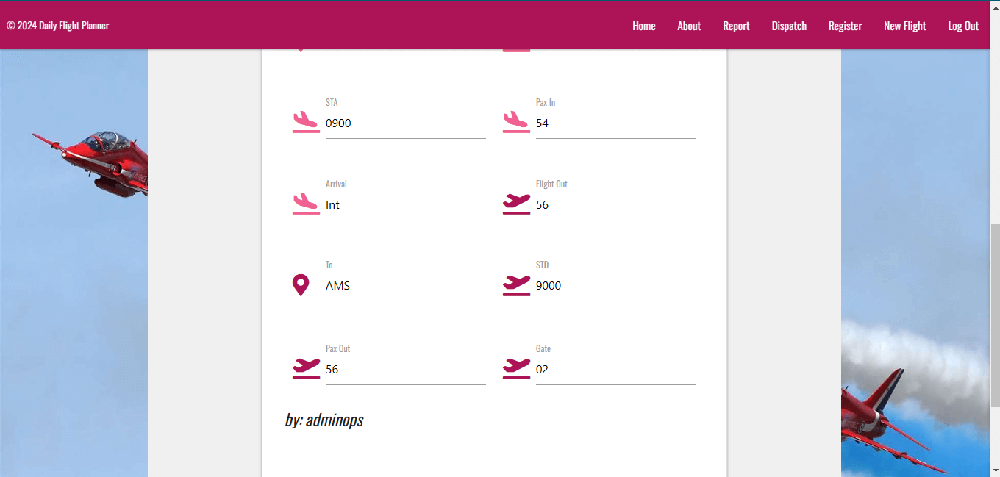

# **Daily Flight Planner**

Daily Flight Planner is an application designed for the aviation industry, especially for operations/dispatchers, that allows the planning and assignment of daily flights at an airport to various dispatchers. There are two types of login with two different levels of privileges:

AdminOps Account:

- Home: Access to view daily flights and the privilege to edit and delete already dispatched flights and perform a search by name or flight number in the database.
- About: Access to a description of the app and a glossary of terms and abbreviations used in the app.
- Report: Ability to create and edit flight reports, similar to other users, as this is not an exclusive privilege of the AdminOps account because the Operations Manager will later review and archive the report definitively and store it for 90 days.
- Dispatch: Access to the names and IDs of dispatchers currently working at the airport, with the privilege to add, edit, and delete dispatch files.
- Register: Exclusive privilege to create login credentials for dispatchers.
- New Flight: Privilege to create and schedule daily flights.
This comprehensive access allows AdminOps to manage various aspects of flight operations efficiently.
- Log Out: Access to the Log Out page to sign out of their profile.

Dispatch Account:

- Home: Access to the home page where the dispatcher can view their daily flights and perform a search by name or flight number in the database.
- About: Access to a description of the app and a glossary of terms and abbreviations used in the app.
- Report: Ability to create and edit flight reports, similar to other users, the Operations Manager will later review and archive the report definitively and store it for 90 days.
- Log Out: Access to the Log Out page to sign out of their profile.

[Daily Flight Planner](https://daily-flight-planner-3bcd72540a25.herokuapp.com/)

## Site owner Goals

- TThe purpose of this app is to provide a solution for companies operating in the aviation sector, enhancing the creation and planning of daily flights. This app is primarily aimed at AdminOps and Dispatchers.
- To provide the user an app where Operatives/Dispatch team can planning in a better way their daily ground service.
- To provide the user with an app that is easy to navigate, fully responsive, that invokes a sense of no-stress through the use of appropriate colors and layout.
- To provide the user the instructions of the app.

## User Stories

### First time user

- As a first time user I want to understand the main purpose of the DFP app.
- As a first time user I want to be able to intuitively navigate the DFP app.
- As a first time user I want a fully responsive app.
- As a first time user I want a full instructions to navigate and know how to use the DFP app.

### Returning User

- As a returning user I want to easily navigate to the Daily Flight planner app.
- As a returning user I want to choose different level of privilege that the different type user have on Daily Flight Planner.
- As a returning user I want to do my work intuitively, quickly, and securely.

### Frequent User

- As a frequent user I want to be familiar with the application, as it is intuitive and secure, so that using the app does not create stress during working hours.

## Design

### Imagery

The imagery used on the Daily Flight Planner site is very important to the overall experience of the user. A relaxed Red Arrows background, white background of container, different grade of pink is consistently used. This invoke a sense of calm in the user.

### Colours

The image shows an application with a vibrant and contrasting color scheme. Here’s a detailed description of the colors used:

- Main Background: An image with a light blue sky and acrobatic planes.
- Navigation bar: Intense pink (#C2185B).
- Title: Pink background with white text.
- Buttons:
    RESET: Orange background (#FF5722) with white text.
    SEARCH: Pink background (#C2185B) with white text.
Lower panel: Dark purple (#8E24AA) with white text.

General text: Mainly white, with some exceptions in black for improved readability.
In summary, the color scheme is vibrant and well-contrasted, designed to attract attention and facilitate visual interaction.

### Fonts

The Oswald font is the main font used throughout the whole website. This font was imported via Google Fonts. I am using Sans Serif as a backup font, in case for any reason the main font is not being imported into the site correctly.

## Wireframes
Wireframes were produced using Balsamiq. 

 
Desktop Wireframe

 

 

    
Mobile Wireframe

 

 ## Features

| Log In AdminOps Page| Image | 
| :---: | :---: | 
| When the user enters the username and password and clicks the "Log In" button, they will enter the AdminOps User profile.|  |

| Profile page| Image | 
| :---: | :---: | 
|  When the user clicks the "login button" they are welcome message and different buttond where the user can go: |  |
   **Home**: Clickin on Home the user can access the Home page. By clicking, you will encounter the list of flights for the day, an area where you can search in the database, and two buttons where you can delete or edit flights. |  |
   **About**: The user, by clicking on the About button, will encounter a page with an explanation of the app and a button that, when clicked, will return them to the Home page.  |  |
   **Report**: When the user clicks on the report button, they encounter a form where they can enter the report data and a button to send the report to the database. At the bottom, they can view all the reports currently in the database.  |  |
   **Report**:  |  |
   **Dispatch**: When the user clicks on the Dispatch button, they encounter a page where they can add a dispatcher to the existing list by clicking on the "add dispatch" button. Then they see a list of all dispatchers currently working at the airport. Additionally, by clicking on the Edit and Delete buttons, they can delete or edit the dispatchers already present in the database.  |  |
   **Register**: On this page, the user can create a new user account by entering the username, password, and clicking on the register button. |  |
   **New Flight**: When the user clicks on "Add_flight", they will find a form that, when filled out, will allow them to create a new flight. |  |
   **New Flight**:  |  |
   **Log Out**: When the user clicks on "Log Out", they are logged out of the system and automatically redirected to the "Log In" page. |  |

| Home page| Image | 
| :---: | :---: | 
| When the user enters the Home page, they encounter a list of all flights. By clicking on the arrow, a collapsible menu will open, providing all the information about the flight. By clicking on the search button, they can perform a search in the database, looking for flights by name and flight number. Clicking on the "Dispatched" button will delete the flight, and clicking on the "Edit" button will allow them to edit the flight.  |  |
   **Search**: The user clicks on "Search" and perform a search by name or flight number. |  |
   **Search**: |  |
   **Dispatched**: By pressing the arrow, the user can see all the information that the dispatcher has to take off their flight. |  |
   **Dispatched**: |  |
   **Edit**: By pressing "Edit", the user can edit the flight. |  |
   **Edit**: |  |
   **Arrow**: By pressing the "Arrow", the user can check all the flight informations. |  |
   **Edit**: |  |   

| Report page| Image | 
| :---: | :---: | 
| Entering the Report page, the user can fill out the report form and submit it to the database, can view previously archived reports, and can modify and delete a report. |  |
   **Report**: The user can fill out the form and clicking on the send button send it to the database. |  |
   **Report Added**: |  |
   **Report Stored**: The user can check the report already stored. |  |
   **Edit**: | The user can edit the report stored.  |
   **Edit**: |  |
   **Edit**: |  |
   **Delete**: The user can delete the report stored |  |
   **Delete**: |  |

| Dispatch page| Image | 
| :---: | :---: | 
| Entering the Dispatch page, the user can add,edit and delete a dispatcher to the database, |  |
   **Add Dispatch**: The user can add the dispatcher  |  |
   **Add Dispatch**: |  |
   **Edit**: | The user can edit the dispatcher.  |
   **Edit**: |  |
   **Edit**: |  |
   **Edit**: |  |
   **Delete**: The user can delete the dispatcher|  |
   **Delete**: |  |
   **Delete**: |  |
  
   
   

