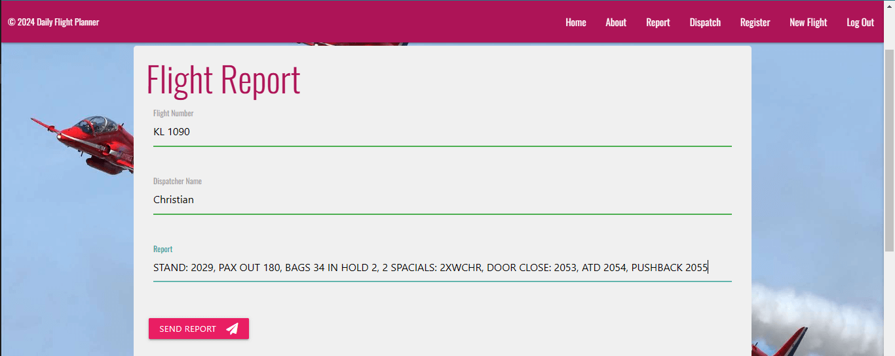
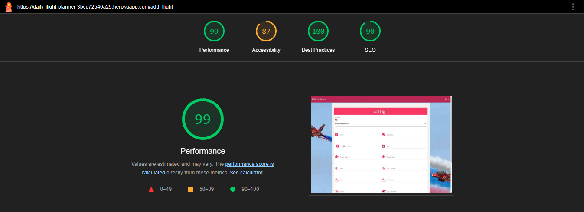
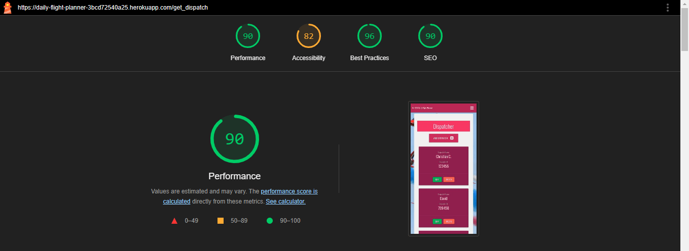

# **Daily Flight Planner**

Daily Flight Planner is an application designed for the aviation industry, especially for operations/dispatchers, that allows the planning and assignment of daily flights at an airport to various dispatchers. There are two types of User with two different levels of privileges:

AdminOps Account:

- Home: Access to view daily flights and the privilege to edit and delete already dispatched flights and perform a search by name or flight number in the database.
- About: Access to a description of the app and a glossary of terms and abbreviations used in the app.
- Report: Ability to create and edit flight reports, similar to other users, as this is not an exclusive privilege of the AdminOps account because the Operations Manager will later review and archive the report definitively and store it for 90 days.
- Dispatch: Access to the names and IDs of dispatchers currently working at the airport, with the privilege to add, edit, and delete dispatch files.
- Register: Exclusive privilege to create login credentials for dispatchers.
- New Flight: Privilege to create and schedule daily flights.
This comprehensive access allows AdminOps to manage various aspects of flight operations efficiently.
- Log Out: Access to the Log Out page to sign out of their profile.

Dispatch Account:

- Home: Access to the home page where the dispatcher can view their daily flights and perform a search by name or flight number in the database.
- About: Access to a description of the app and a glossary of terms and abbreviations used in the app.
- Report: Ability to create and edit flight reports, similar to other users, the Operations Manager will later review and archive the report definitively and store it for 90 days.
- Log Out: Access to the Log Out page to sign out of their profile.

[Daily Flight Planner](https://daily-flight-planner-3bcd72540a25.herokuapp.com/)

| **User** | **Username** | **Password** |
| :---: | :---: | :---: | 
| **AdminOps**: | AdminOps  | christian |
| **Dispatch**: | christian  | Dispatch1 |

## Site owner Goals

- TThe purpose of this app is to provide a solution for companies operating in the aviation sector, enhancing the creation and planning of daily flights. This app is primarily aimed at AdminOps and Dispatchers.
- To provide the user an app where Operatives/Dispatch team can planning in a better way their daily ground service.
- To provide the user with an app that is easy to navigate, fully responsive, that invokes a sense of no-stress through the use of appropriate colors and layout.
- To provide the user the instructions of the app.

## User Stories

### First time user

- As a first time user I want to understand the main purpose of the DFP app.
- As a first time user I want to be able to intuitively navigate the DFP app.
- As a first time user I want a fully responsive app.
- As a first time user I want a full instructions to navigate and know how to use the DFP app.

### Returning User

- As a returning user I want to easily navigate to the Daily Flight planner app.
- As a returning user I want to choose different level of privilege that the different type user have on Daily Flight Planner.
- As a returning user I want to do my work intuitively, quickly, and securely.

### Frequent User

- As a frequent user I want to be familiar with the application, as it is intuitive and secure, so that using the app does not create stress during working hours.

## Design

### Imagery

The imagery used on the Daily Flight Planner site is very important to the overall experience of the user. A relaxed Red Arrows background, white background of container, different grade of pink is consistently used. This invoke a sense of calm in the user.

### Colours

The image shows an application with a vibrant and contrasting color scheme. Here’s a detailed description of the colors used:

- Main Background: An image with a light blue sky and acrobatic planes.
- Navigation bar: Intense pink (#C2185B).
- Title: Pink background with white text.
- Buttons:
    RESET: Orange background (#FF5722) with white text.
    SEARCH: Pink background (#C2185B) with white text.
Lower panel: Dark purple (#8E24AA) with white text.

General text: Mainly white, with some exceptions in black for improved readability.
In summary, the color scheme is vibrant and well-contrasted, designed to attract attention and facilitate visual interaction.

### Fonts

The Oswald font is the main font used throughout the whole website. This font was imported via Google Fonts. I am using Sans Serif as a backup font, in case for any reason the main font is not being imported into the site correctly.

## Wireframes
Wireframes were produced using Balsamiq. 

 
Desktop Wireframe

 

 

    
Mobile Wireframe

 

 ## Features

| Log In AdminOps Page| Image | 
| :---: | :---: | 
| When the user enters the username and password and clicks the "Log In" button, they will enter the AdminOps User profile.|  |

| Profile page| Image | 
| :---: | :---: | 
|  When the user clicks the "login button" there is a welcome message and different button where the user can go: |  |
   **Home**: Clickin on Home the user can access the Home page. By clicking, you will encounter the list of flights for the day, an area where you can search in the database, and two buttons where you can delete or edit flights. |  |
   **About**: The user, by clicking on the About button, will encounter a page with an explanation of the app and a button that, when clicked, will return them to the Home page.  |  |
   **Report**: When the user clicks on the report button, they encounter a form where they can enter the report data and a button to send the report to the database. At the bottom, they can view all the reports currently in the database.  |  |
   **Report**:  |  |
   **Dispatch**: When the user clicks on the Dispatch button, they encounter a page where they can add a dispatcher to the existing list by clicking on the "add dispatch" button. Then they see a list of all dispatchers currently working at the airport. Additionally, by clicking on the Edit and Delete buttons, they can delete or edit the dispatchers already present in the database.  |  |
   **Register**: On this page, the user can create a new user account by entering the username, password, and clicking on the register button. |  |
   **New Flight**: When the user clicks on "Add_flight", they will find a form that, when filled out, will allow them to create a new flight. |  |
   **New Flight**:  |  |
   **Log Out**: When the user clicks on "Log Out", they are logged out of the system and automatically redirected to the "Log In" page. |  |

| Home page| Image | 
| :---: | :---: | 
| When the user enters the Home page, they encounter a list of all flights. By clicking on the arrow, a collapsible menu will open, providing all the information about the flight. By clicking on the search button, they can perform a search in the database, looking for flights by name and flight number. Clicking on the "Dispatched" button will delete the flight, and clicking on the "Edit" button will allow them to edit the flight.  |  |
   **Search**: The user clicks on "Search" and perform a search by name or flight number. |  |
   **Search**: |  |
   **Dispatched**: By pressing the arrow, the user can see all the information that the dispatcher has to take off their flight. |  |
   **Dispatched**: |  |
   **Edit**: By pressing "Edit", the user can edit the flight. |  |
   **Edit**: |  |
   **Arrow**: By pressing the "Arrow", the user can check all the flight informations. |  |
   **Edit**: |  |   

| Report page| Image | 
| :---: | :---: | 
| Entering the Report page, the user can fill out the report form and submit it to the database, can view previously archived reports, and can modify and delete a report. |  |
   **Report**: The user can fill out the form and clicking on the send button send it to the database. |  |
   **Report Added**: |  |
   **Report Stored**: The user can check the report already stored. |  |
   **Edit**: | The user can edit the report stored.  |
   **Edit**: |  |
   **Edit**: |  |
   **Delete**: The user can delete the report stored |  |
   **Delete**: |  |

| Dispatch page| Image | 
| :---: | :---: | 
| Entering the Dispatch page, the user can add,edit and delete a dispatcher to the database, |  |
   **Add Dispatch**:   |  |
   **Add Dispatch**: |  |
   **Edit**: | The user can edit the dispatcher.  |
   **Edit**: |  |
   **Edit**: |  |
   **Edit**: |  |
   **Delete**: The user can delete the dispatcher|  |
   **Delete**: |  |
   **Delete**: |  |
  
| Add Flight page| Image | 
| :---: | :---: | 
| By entering the New flight page, filling out the form, and pressing the "add flight" button, the user can add a new flight to the database. |  |
   **Add Flight**: |  |
   **Add Flight**: |  |
   **Add Flight**: |  |
   **Add Flight**: |  |
   
| About page| Image | 
| :---: | :---: | 
| By entering the About page, the user can read information about the app. |  |
   **Add Flight**: They can read a glossary of some terms used. |  |
   **Add Flight**: By pressing the "GO to Home" button, they will be redirected to the Home page. |  |

| Register and Log Out page| Image | 
| :---: | :---: | 
| By entering the "Register" page, the "AdminOps" user can create a new user.  |  |
   **Register**: y filling out the form and clicking on register, the user will create a new account. |  |
   **Register**: New Account created |  |
   **Log Out**: By clicking the "Log Out" button, the user will exit the system. |  |

   | Log In Dispatcher Page| Image | 
| :---: | :---: | 
| When the user enters the username and password and clicks the "Log In" button, they will enter the Dispatcher profile. This type of user has limited functionalities as they are at a lower level than the AdminOps user. |  |

| Dispatch Profile page| Image | 
| :---: | :---: | 
|  When the user clicks the "login button" there is welcome message and different button where the user can go: |  |
   **Home**: Clickin on Home the user can access the Home page. By clicking, you will encounter the list of flights for the day, an area where you can search in the database. |  |
   **About**: The user, by clicking on the About button, will encounter a page with an explanation of the app and a button that, when clicked, will return them to the Home page.  |  |
   **Report**: When the user clicks on the report button, they encounter a form where they can enter the report data and a button to send the report to the database. At the bottom, they can view all the reports currently in the database.  |  |
   **Report**:  |  |
   **Log Out**: When the user clicks on "Log Out", they are logged out of the system and automatically redirected to the "Log In" page. |  |

   ## Features left to Implement

| Number | Feature |
| :---: | :---: |
| 1 |By adding new functionalities to the report page, creating a more detailed form for the report. |
| 2 | Integrating the app with the check-in agent app, with the ramp app, and with the airport management. Creating a SuperUser to manage this entire system. |

## Testing

### Validator Testing

- #### HTML
    - No errors were returned when passing through the official W3C Markup Validator

| File | Test | Pass | Image |
| :---: | :---: | :---: | :---: | 
| about.html | The test consists of placing the file in the validator and verifying that there are no errors. | Yes ||
| Add_flight.html | The test consists of placing the file in the validator and verifying that there are no errors. | Yes ||
| logIn.html | The test consists of placing the file in the validator and verifying that there are no errors. | Yes ||
| LogOut.html | The test consists of placing the file in the validator and verifying that there are no errors. | Yes ||
| register.html | The test consists of placing the file in the validator and verifying that there are no errors. | Yes ||
| report.html | The test consists of placing the file in the validator and verifying that there are no errors. | Yes ||

- #### CSS
    - No errors were found when passing through the official W3C CSS Validator

| File | Test | Pass | Image |
| :---: | :---: | :---: | :---: | 
| style.css | The test consists of placing the file in the validator and verifying that there are no errors. | Yes ||

- #### JS
    - No errors were found when passing through the JavaScript validation from JSHint.com

| File | Test | Pass | Image |
| :---: | :---: | :---: | :---: | 
| script.js | The test consists of placing the file in the validator and verifying that there are no errors. | Yes ||

- #### Python
    - No errors were found when passing through the JavaScript validation from JSHint.com

| File | Test | Pass | Image |
| :---: | :---: | :---: | :---: | 
| app.py | The test consists of placing the file in the validator and verifying that there are no errors. | Yes ||

- #### Accessibility 
  - The site achieved a Lighthouse accessibility median score of 99% which confirms that the colours and fonts chosen are easy to read and accessible.

    - Desktop

| File | Test | Pass | Image |
| :---: | :---: | :---: | :---: | 
| about.html | The test consists of placing the file in the Lighthouse google tools and verifying the accessibility of the site. Tested the desktop version. | Yes |
| dispatch.html | The test consists of placing the file in the Lighthouse google tools and verifying the accessibility of the site. Tested the desktop version. | Yes |
| home.html | The test consists of placing the file in the Lighthouse google tools and verifying the accessibility of the site. Tested the desktop version. | Yes |
| login.html | The test consists of placing the file in the Lighthouse google tools and verifying the accessibility of the site. Tested the desktop version. | Yes |
| newFlight.html | The test consists of placing the file in the Lighthouse google tools and verifying the accessibility of the site. Tested the desktop version. | Yes |
| register.html  | The test consists of placing the file in the Lighthouse google tools and verifying the accessibility of the site. Tested the desktop version. | Yes |
| report.html  | The test consists of placing the file in the Lighthouse google tools and verifying the accessibility of the site. Tested the desktop version. | Yes |

- #### Accessibility 
  - The site achieved a Lighthouse accessibility median score of 90% which confirms that the colours and fonts chosen are easy to read and accessible.

    - Mobile  

| File | Test | Pass | Image |
| :---: | :---: | :---: | :---: | 
| about.html | The test consists of placing the file in the Lighthouse google tools and verifying the accessibility of the site. Tested the desktop version. | Yes |
| dispatch.html | The test consists of placing the file in the Lighthouse google tools and verifying the accessibility of the site. Tested the desktop version. | Yes |
| home.html | The test consists of placing the file in the Lighthouse google tools and verifying the accessibility of the site. Tested the desktop version. | Yes |
| login.html | The test consists of placing the file in the Lighthouse google tools and verifying the accessibility of the site. Tested the desktop version. | Yes |
| newFlight.html | The test consists of placing the file in the Lighthouse google tools and verifying the accessibility of the site. Tested the desktop version. | Yes |
| register.html  | The test consists of placing the file in the Lighthouse google tools and verifying the accessibility of the site. Tested the desktop version. | Yes |
| report.html  | The test consists of placing the file in the Lighthouse google tools and verifying the accessibility of the site. Tested the desktop version. | Yes |

- ### Testing User Stories
  I set some manual test to test the User Stories.

| Name | Test | Result | Pass |
| :---: | :---: | :---: | :---: | 
| Test 1 | As a user, I want the site to be intuitive, so I can quickly find the functionality. | All acceptance for the intuitive experience have been met, as verified through user testing. | Yes |
| Test 2 | As a user, I want the site to be responsive. | All acceptance criteria for responsive app have been meet, as verified through comprehensive testing on a variety of devices and browsers | Yes |
| Test 3 | As a user, I want to be able to choose in a fast way all my option. | All acceptance criteria for the topic selection have been meet, as verified through user testing. | Yes |
| Test 4 | As a user, I want be able to check the instructions of the app. | All acceptance criteria for dynamic have been meet, as verified through comprehensive user testing. | Yes |

### Browser Testing
- The Website was tested on Google Chrome, Firefox, Microsoft Edge, Safari browsers with no issues noted.
    
### Device Testing
- The website was viewed on a variety of devices such as Desktop, Laptop, iPhone 8, iPhoneX and iPad to ensure responsiveness on various screen sizes. The website performed as intended. The responsive design was also checked using Chrome developer tools across multiple devices with structural integrity holding for the various sizes.
- I also used the following websites to test responsiveness:
   - [Responsinator](http://www.responsinator.com/?url=https%3A%2F%2Fdaily-flight-planner-3bcd72540a25.herokuapp.com%2F)
   - [Am I Responsive](https://ui.dev/amiresponsive?url=https://daily-flight-planner-3bcd72540a25.herokuapp.com/)

### Friends and Family User Testing
Friends and family members were asked to review the site and documentation to point out any bugs and/or user experience issues.

## Bugs

| Bug | Problem | Cause | Solution |
| :---: | :---: | :---: | :---: | 
|  Not unique Id for input field in flights.html | Error during validation | For Loop | id="stand_{{ flight.id }}_{{ loop.index }}" |

## Technologies Used

### Languages
- HTML5
- CSS
- Jquery
- JavaScript
- Python

### Frameworks - Libraries - Programs Used
- [Am I Responsive](http://ami.responsivedesign.is/) - Used to verify responsiveness of website on different devices.
- [Responsinator](http://www.responsinator.com/) - Used to verify responsiveness of website on different devices.
- [Balsamiq](https://balsamiq.com/) - Used to generate Wireframe images.
- [Chrome Dev Tools](https://developer.chrome.com/docs/devtools/) - Used for overall development and tweaking, including testing responsiveness and performance.
- [Font Awesome](https://fontawesome.com/) - Used for Social Media icons in footer.
- [GitHub](https://github.com/) - Used for version control and hosting.
- [Google Fonts](https://fonts.google.com/) - Used to import and alter fonts on the page.
- [TinyPNG](https://tinypng.com/) - Used to compress images to reduce file size without a reduction in quality.
- [W3C](https://www.w3.org/) - Used for HTML & CSS Validation.
- [JavaScript Validation](https://JSHint.com) - Used to validate the JavaScript code.
- [pep8ci](https://pep8ci.herokuapp.com/) - Used to validate the Python code.
- [Flask](https://pypi.org/project/Flask/) - Micro framework for site templating.
- [Materialize v1.0.0](https://materializecss.com) - The framework for the website.
- [Font Awesome](https://fontawesome.com/) - For the iconography on the website.
- [Jinja](https://jinja.palletsprojects.com/en/3.1.x/) - Templating engine.
- [Google Fonts](https://fonts.google.com/) - To import the fonts used on the website.

### Programs

- [Favicon](https://favicon.io/) - To create the favicon for the site.

- [Heroku](https://www.heroku.com) - For website deployment.

- [MongoDB](https://www.mongodb.com) - The database used for storing information for the site.

## Deployment & Local Development

### MongoDB Non-Relational Database

This project uses [MongoDB](https://www.mongodb.com) for the Non-Relational Database.

### Heroku Deployment

This project uses [Heroku](https://www.heroku.com), a platform as a service (PaaS) that enables developers to build, run, and operate applications entirely in the cloud.

Deployment steps are as follows, after account setup:

- Select __New__ in the top-right corner of your Heroku Dashboard, and select __Create new app__ from the dropdown menu.
- Your app name must be unique, and then choose a region closest to you (EU or USA), and finally, select __Create App__.
- From the new app __Settings__, click __Reveal Config Vars__, and set your environment variables.

| Key | Value |
| --- | --- |
| `DATABASE_URL` | user's own value |
| `IP` | 0.0.0.0 |
| `MONGO_DBNAME` | user's own value |
| `MONGO_URI` | user's own value |
| `PORT` | 5000 |
| `SECRET_KEY` | user's own value |

Heroku needs two additional files in order to deploy properly.

- requirements.txt
- Procfile

You can install this project's __requirements__ (where applicable) using:

- `pip3 install -r requirements.txt`

If you have your own packages that have been installed, then the requirements file needs updated using:

- `pip3 freeze --local > requirements.txt`

The **Procfile** can be created with the following command:

- `echo web: python app.py > Procfile`
- *replace __app.py__ with the name of your primary Flask app name; the one at the root-level*

NOTE: The Procfile uses a capital P and doesn't have a file extension on the end.

For Heroku deployment, follow these steps to connect your own GitHub repository to the newly created app:

Either:

- Select __Automatic Deployment__ from the Heroku app.

Or:

- In the Terminal/CLI, connect to Heroku using this command: `heroku login -i`
- Set the remote for Heroku: `heroku git:remote -a app_name` (replace *app_name* with your app name)
- After performing the standard Git `add`, `commit`, and `push` to GitHub, you can now type:
	- `git push heroku main`

The project should now be connected and deployed to Heroku!

### Local Deployment

This project can be cloned or forked in order to make a local copy on your own system.

For either method, you will need to install any applicable packages found within the *requirements.txt* file.

- `pip3 install -r requirements.txt`.

#### How to Fork

By forking the GitHub Repository, we make a copy of the original repository on our GitHub account to view and/or make changes without affecting the original owner's repository.
You can fork this repository by using the following steps:

1. Log in to GitHub and locate the [GitHub Repository](https://github.com/ChristianCricchi/Daily_Flight_Planner)
2. At the top of the Repository (not top of page) just above the "Settings" Button on the menu, locate the "Fork" Button.
3. Once clicked, you should now have a copy of the original repository in your own GitHub account!

#### How to Clone

You can clone the repository by following these steps:

1. Go to the [GitHub repository](https://github.com/ChristianCricchi/Daily_Flight_Planner) 
2. Locate the Code button above the list of files and click it 
3. Select if you prefer to clone using HTTPS, SSH, or GitHub CLI and click the copy button to copy the URL to your clipboard
4. Open Git shell or Terminal
5. Change the current working directory to the one where you want the cloned directory
6. In your IDE Terminal, type the following command to clone my repository:
	- `git clone https://github.com/ChristianCricchi/Daily_Flight_Planner`
7. Press Enter to create your local clone.

## Credits

### Content
All educational content was sourced from the below websites:
- [Code Institute](https://learn.codeinstitute.net/courses/course-v1:CodeInstitute+NRDB_L5+2/courseware/9e2f12f5584e48acb3c29e9b0d7cc4fe/0d4e3419132440d9b2c0943f80dc54a8/?child=first)

### Media

All images and videos were sourced from the below websites.

- [Favicon](https://favicon.io/)

## Acknowledgments

My lovely wife Vivian for her support, advice and help in the crisis moments.

My mentor Antonio for his support and advice.

Amy for the interesting and useful information shared on oct-2023-pla weekly meeting.

The Code Institute slack community for their quick responses and very helpful feedback. 

   
   
   
   

